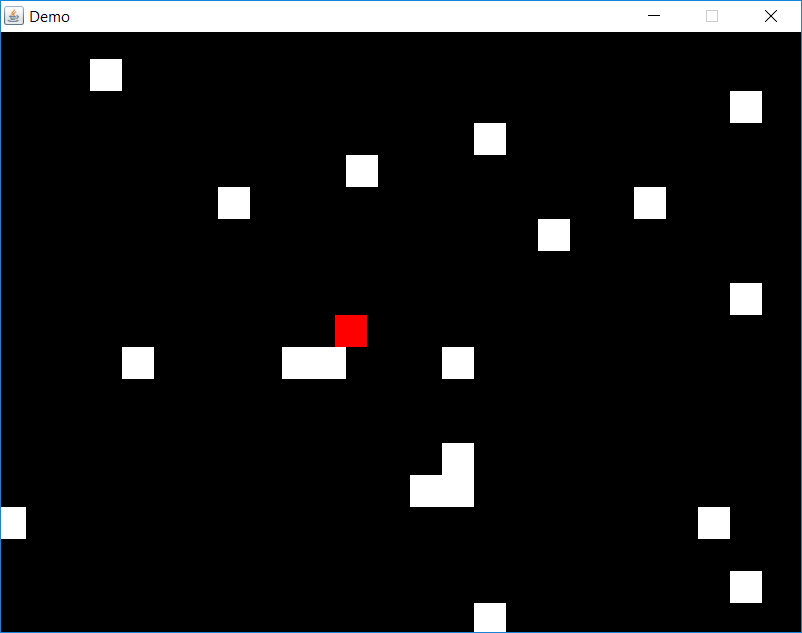

# 2D Tile-Based Engine

A 2D tile-based game engine using axis-aligned bounding boxes.

## Features

**:balloon: Ultra-lightweight**

Handles state management, physics, entities and camera tracking out-of-the-box,
with no external dependencies.
 
**:mount_fuji: Slope support**

Supports 45 degree floor and ceiling slopes, and new tile types can easily be
added.

**:electric_plug: Extendible component-based entity system**

Entities can easily be extended with additional properties and behaviour using a
flexible component-based system.

**:books: Easily integrate with any GUI / rendering / input library**

Window creation, rendering and input handling are abstracted; the engine is not
tied to any existing libraries.

## Getting Started

A demo project using the Java Swing library is included, but the basic steps are
detailed below.

### Initialise Display

Extend `Launcher` and provide your own implementation for window creation and
rendering using your preferred libraries.

### Handle Input

Listen for input using your preferred library, and pass events to the launcher's
`input` field. This will make the latest input available to the current state
each frame. 

### Create a State

The launcher has one active `State` at any time, which is updated and rendered
each frame. This may be a loading screen, a menu, or the game itself.

A basic game state should instantiate the `Logic` and a `Camera` (if
required), and override the following methods:

 - `processInput()`: Process the user input from the last frame.

 - `update()`: Update the `Logic` and `Camera`.
 
 - `render()` Tell some renderer to render the game.

### Start the Game!

In your `main` method, instantiate your launcher, load your initial state, and
call `launcher.start()`.

### Add Entities

To add an Entity to the world, subclass Entity and use the following:

    MyEntity entity = new MyEntity(x, y);
    logic.addEntity(entity);

Components can be added to Entities to add new properties and behaviour. For
example, you might add a graphical component to an Entity to allow it to be
rendered.

### Camera Tracking

To make the camera track a particular Entity, use the following code:

    camera.trackEntity(entity);
    camera.teleportToDestination();
